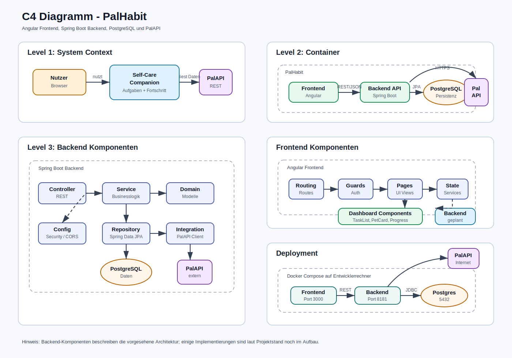

# Kontext und Abgrenzung

PokeHabit ist die Web-App, die wir für die SQS-Semesterarbeit gebaut haben. Im
Kern geht es um tägliche Quests, Wassertracking und einen Pokémon-Partner, der
durch erledigte Aufgaben Fortschritt bekommt.

Zum eigenen System zählen das Angular-Frontend, das Spring-Boot-Backend und die
PostgreSQL-Datenbank für die lokale Qualitätssicherung.
Externe Nachbarsysteme sind die PokeAPI für Pokémon-Daten und Open-Meteo für
Wetterdaten.

## Kontextdiagramm

Die Kontextsicht grenzt PokeHabit von externen Kommunikationspartnern ab. Sie
zeigt Nutzer, das eigene System und die externen Dienste, mit denen PokeHabit
kommuniziert.

Eine zusammengefasste Übersicht über Kontext-, Container-, Komponenten- und
Deployment-Sicht befindet sich zusätzlich im C4-Gesamtdiagramm:

## Fachlicher Kontext

| Nachbar                  | Beziehung                                                                                                                              |
| ------------------------ | -------------------------------------------------------------------------------------------------------------------------------------- |
| Nutzer                   | Nutzt die Browseroberfläche für Login, Registrierung, Quests, Wassertracking, Wetteranzeige, Pokémon-Fortschritt und Account-Löschung. |
| PokeAPI / Pokémon-Bilder | Liefert Pokémon-Daten, Namen und Bildquellen für den Pokémon-Partner.                                                                  |
| Open-Meteo               | Liefert Wetterdaten für die Szene im Dashboard.                                                                                        |
| SQS-Bewertung            | Prüft den Stand über Dokumentation, Docker-Start, Tests, C4-Diagramme und Architekturentscheidungen.                      |

## Technischer Kontext

| Schnittstelle                           | Beschreibung                                                                                                                                        |
|-----------------------------------------| --------------------------------------------------------------------------------------------------------------------------------------------------- |
| Browser -> Angular-Frontend             | Lädt die Angular-App; im Docker-Setup wird das Frontend über Nginx bereitgestellt.                                                                  |
| Angular-Frontend -> Spring-Boot-Backend | Ruft REST-Endpunkte für Authentifizierung, Tasks, User-Daten, Wassertracking, Wetterdaten und Pokémon-Fortschritt auf.                              |
| Spring-Boot-Backend -> PostgreSQL       | Speichert Benutzer, Tasks, Aufgabenstatus, Fortschritt, Wasserstand, Streak, Starter-Pokémon und Pokémon-Zustand.                                   |
| Spring-Boot-Backend -> PokeAPI          | Holt bei Bedarf Pokémon-Daten, Namen und Artwork. Bei Timeout oder Fehlern greift ein lokaler Fallback.                                             |
| Spring-Boot-Backend -> Open-Meteo       | Holt Wetterdaten für die Dashboard-Szene. Bei Fehlern liefert das Backend einen Fallback-Zustand oder die App bleibt mit lokalem Zustand benutzbar. |
| SonarQube -> Projekt                    | Führt Maven-, npm-, Vitest-, ESLint-, SpotBugs-, Checkstyle-, npm-audit- und Playwright-Checks aus.                                                 |

## Abgrenzung des Systems

Innerhalb des Systems liegen:

* Angular-Frontend
* Spring-Boot-Backend
* PostgreSQL-Datenbank
* Docker-Compose-Konfiguration
* lokale Demo- und Testdaten

Außerhalb des Systems liegen:

* Nutzerbrowser als Zugriffsumgebung
* PokeAPI als externer Pokémon-Dienst
* Open-Meteo als externer Wetterdienst
* GitHub als Repository- und CI-Plattform
* ReadTheDocs als Veröffentlichungsplattform der Dokumentation

## Nicht im Scope

* Öffentliches Produktivhosting mit eigener Domain und TLS.
* Externer Login-Anbieter wie Google, GitHub oder Microsoft.
* Native Mobile-App.
* Produktives Rollen- und Rechtemodell.
* Vollständige Tageshistorie mit append-only Task-Completions.
* Hochverfügbare Cloud-Datenbank.
