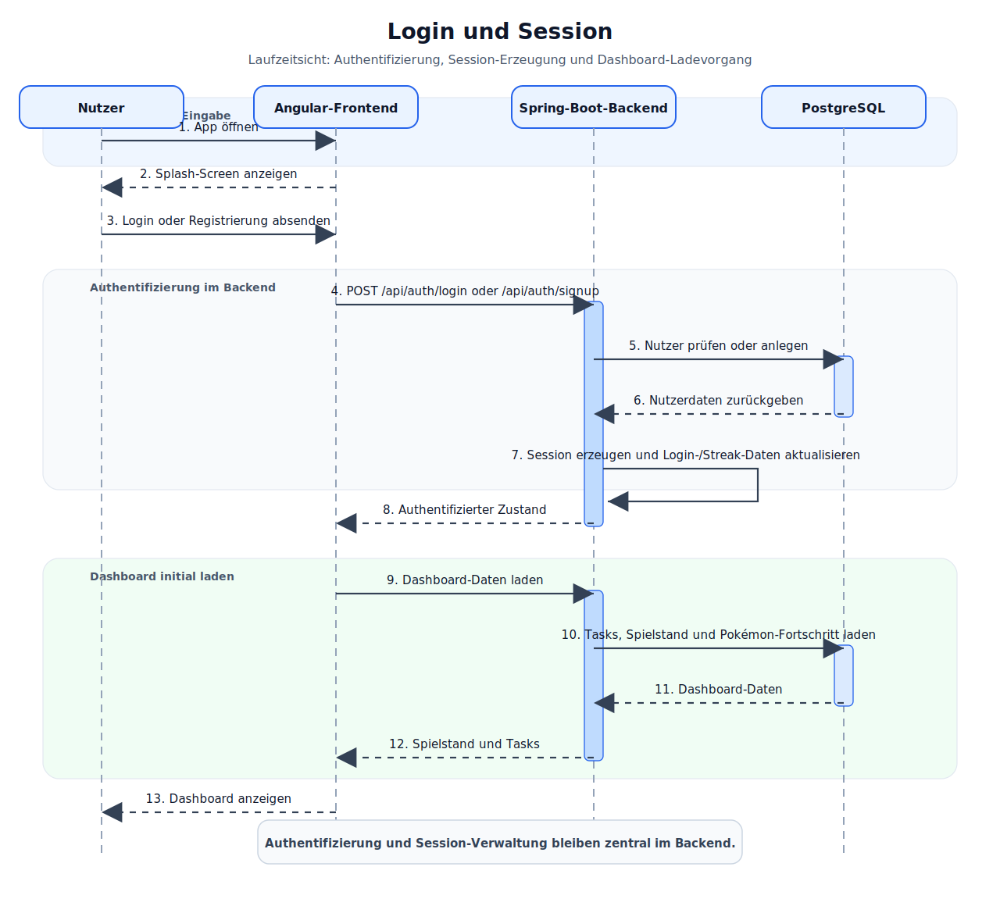
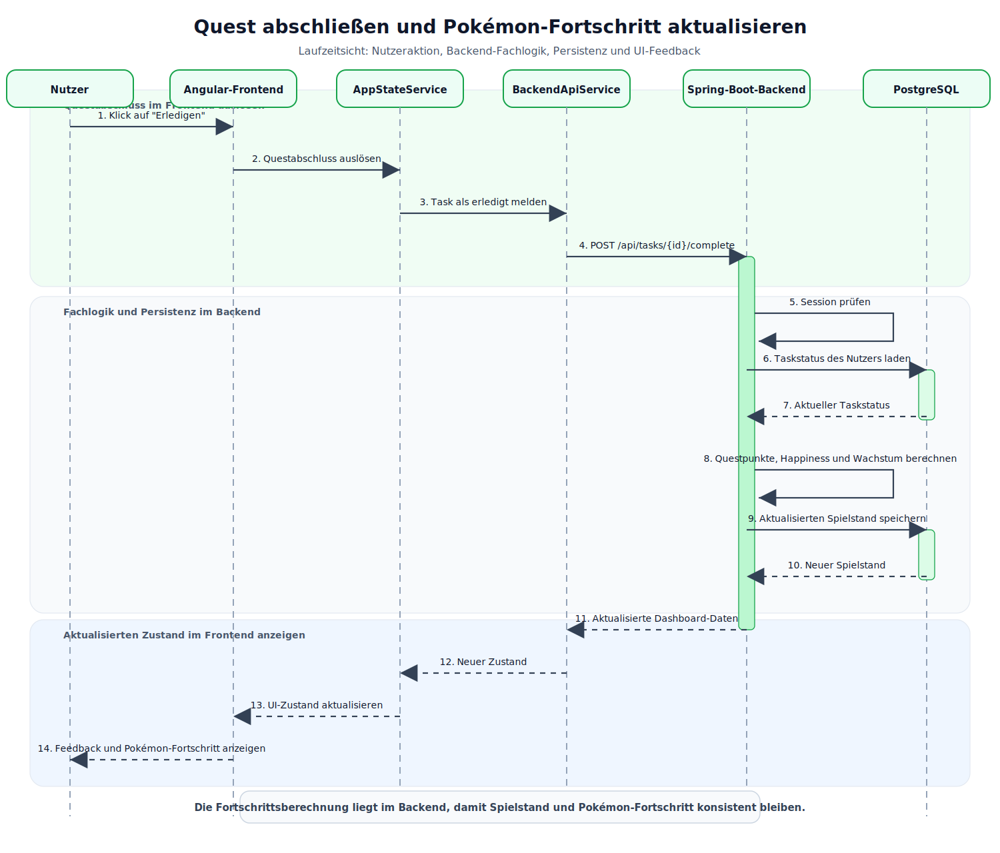
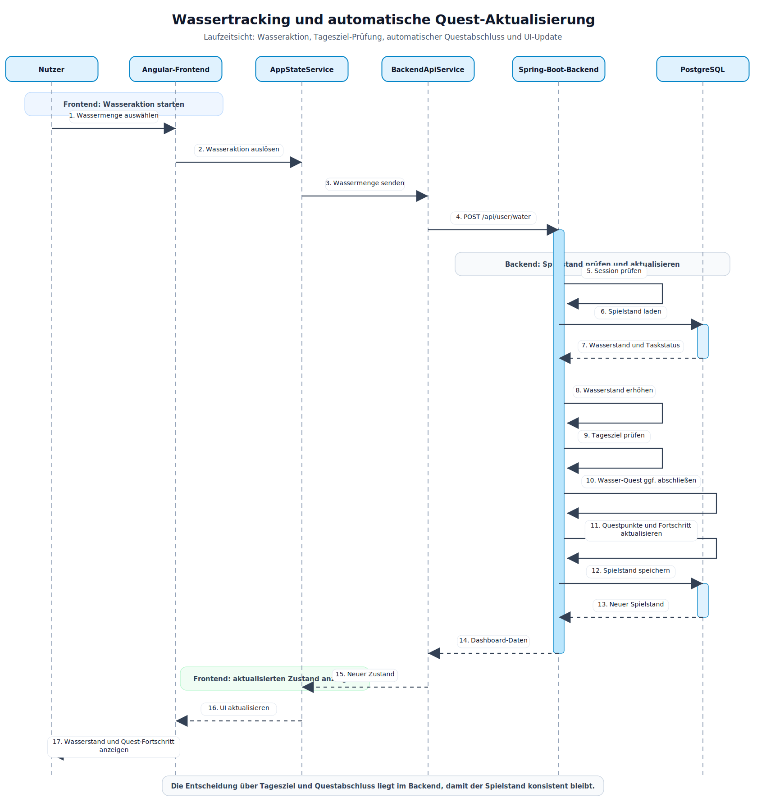
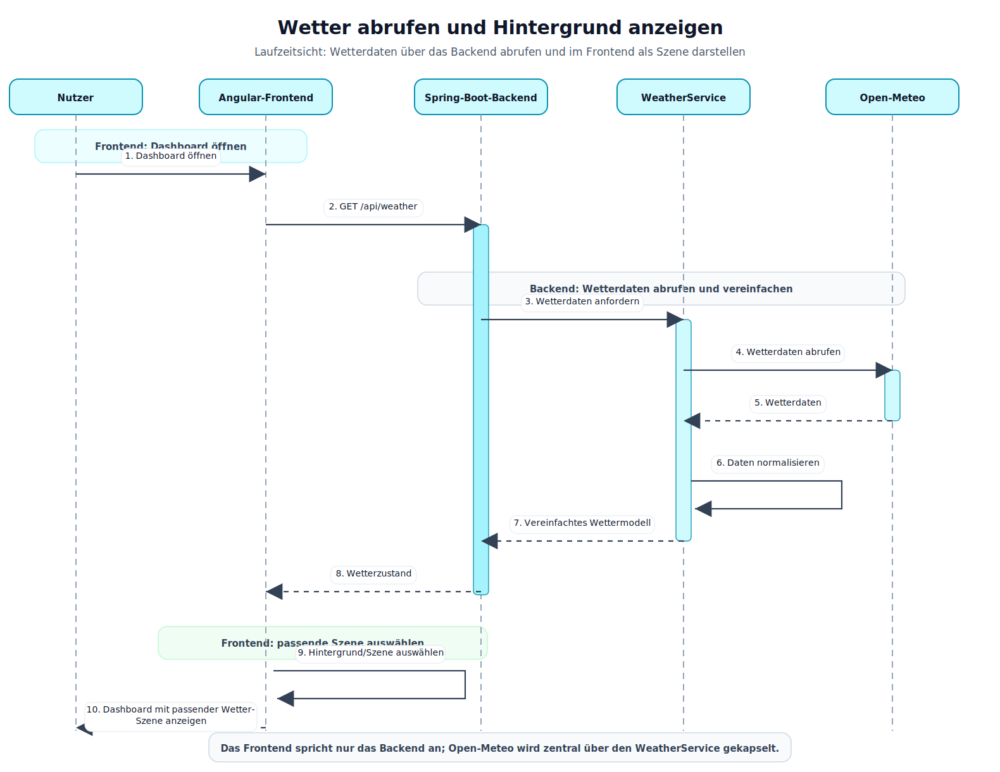
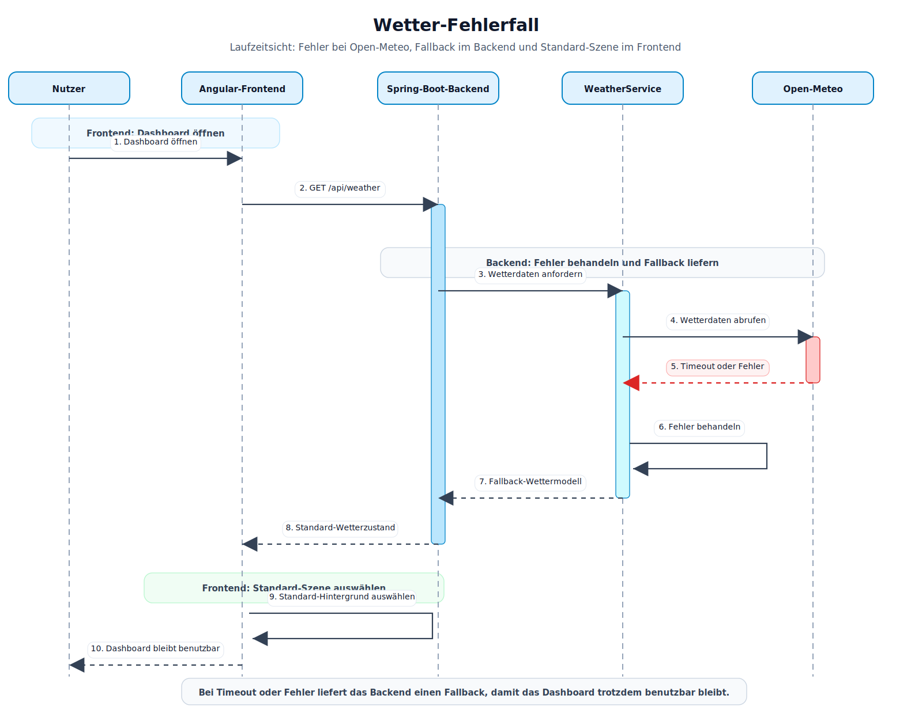
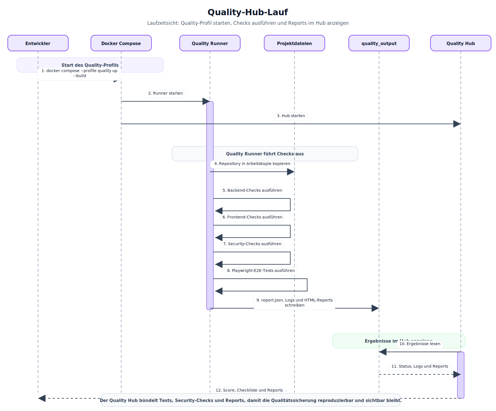

# Laufzeitsicht

Die Laufzeitsicht beschreibt zentrale dynamische Abläufe der Anwendung. Sie zeigt,
wie Frontend, Backend, Datenbank, externe Dienste und Quality Hub zur Laufzeit
zusammenarbeiten. Dokumentiert werden insbesondere fachlich wichtige User-Flows,
externe Schnittstellen und qualitätsrelevante Abläufe.

## Login und Session

[Mermaid-Quelle](../diagrams/mermaid/runtime-login-session.mmd)

Der Login-Flow stellt sicher, dass fachliche Funktionen nur für angemeldete
Nutzer ausgeführt werden. Registrierung und Login laufen über das Backend, damit
Authentifizierung, Session-Verwaltung und Nutzerzustand zentral kontrolliert
werden.

## Quest abschließen und Pal-Fortschritt aktualisieren

[Mermaid-Quelle](../diagrams/mermaid/quest-fortschritt.mmd)

Dieser Flow ist fachlich zentral, weil hier die Gamification-Logik sichtbar wird.
Ein Klick im Frontend führt nicht nur zu einer UI-Änderung, sondern aktualisiert
serverseitig Taskstatus, Questpunkte, Happiness und Pal-Fortschritt.

## Wassertracking und automatische Quest-Aktualisierung

[Mermaid-Quelle](../diagrams/mermaid/watertracking.mmd)

Dieser Ablauf zeigt eine wichtige fachliche Ausnahme: Eine Nutzeraktion kann
indirekt eine Quest abschließen. Die Entscheidung darüber liegt im Backend,
damit der Spielstand konsistent bleibt und nicht allein vom Frontend abhängt.

## Wetter abrufen und Hintergrund anzeigen

[Mermaid-Quelle](../diagrams/mermaid/weather.mmd)

Die Wetter-API wird nicht direkt aus dem Browser angesprochen, sondern über das
Backend gekapselt. Dadurch bleiben externe Schnittstellen, Fehlerbehandlung und
mögliche API-Konfigurationen zentral im Backend. Das Frontend erhält nur ein
vereinfachtes Wettermodell und entscheidet daraus, welche Szene angezeigt wird.

## Wetter-Fehlerfall

[Mermaid-Quelle](../diagrams/mermaid/weather-error.mmd)

Der Fehlerfall ist wichtig, weil externe Dienste nicht vollständig kontrolliert
werden können. Bei Timeout oder Fehler liefert das Backend einen kontrollierten
Fallback, sodass das Dashboard weiterhin benutzbar bleibt.

## Quality-Hub-Lauf

[Mermaid-Quelle](../diagrams/mermaid/quality-hub.mmd)

Der Quality-Hub-Lauf macht die Qualitätssicherung reproduzierbar. Tests,
Coverage, statische Analyse, Security-Prüfungen und E2E-Tests werden nicht nur
lokal einzeln ausgeführt, sondern gebündelt im Docker-Profil gestartet und über
den Hub sichtbar gemacht.
