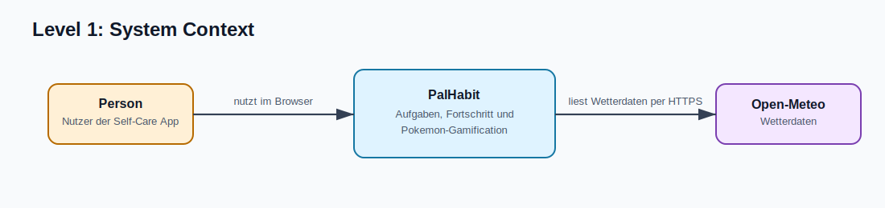
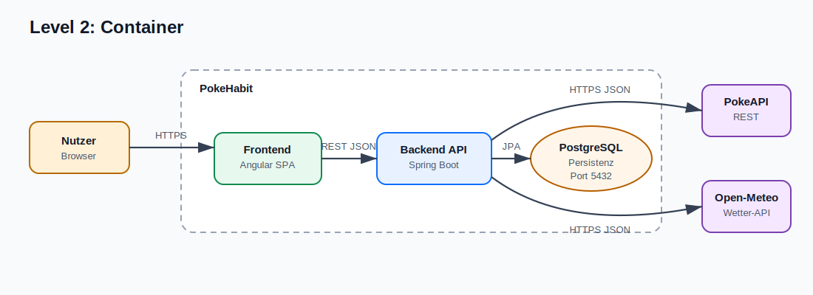
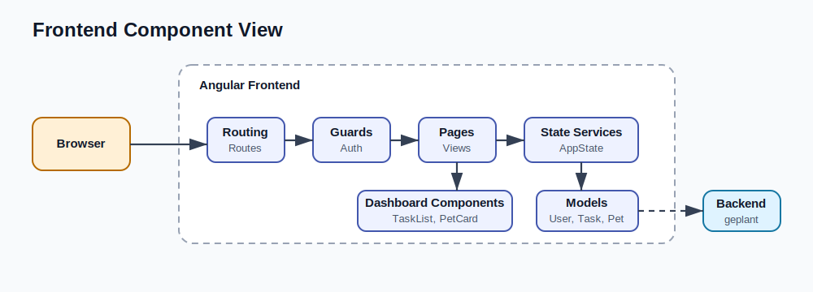
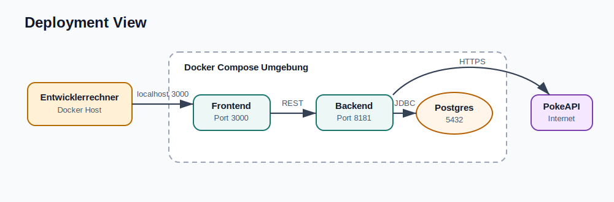

# C4 Diagramm - PokeHabit

Dieses Dokument beschreibt die Architektur der PalHabit-Webanwendung im
C4-Stil. Es geht um den aktuellen Stand der Abgabe: Angular-Frontend,
Spring-Boot-Backend, PostgreSQL, Open-Meteo als externe Laufzeitabhängigkeit,
initiale Pokémon-Stammdaten aus Seed-/Migrationsdaten und der lokale Quality Hub.

PokeAPI ist in den Diagrammen nicht als Laufzeitabhängigkeit dargestellt. Die
benötigten Pokémon-Stammdaten liegen in PostgreSQL. PokeAPI ist nur die
ursprüngliche Datenquelle für diese Seed-/Migrationsdaten.

## Quellen

| Datei                                                    | Zweck                                                                                 |
|----------------------------------------------------------| ------------------------------------------------------------------------------------- |
| [structurizr/workspace.dsl](./structurizr/workspace.dsl) | Bearbeitbare Structurizr-DSL für System Context, Container und Backend-Komponenten.   |
| [c4-diagram-palhabit.svg](./c4-diagram-pokehabit.svg)    | Kompakte gerenderte Übersicht für Markdown-Preview und Präsentation.                  |
| [mermaid/README.md](./mermaid/README.md)                 | Zusätzliche Mermaid-Quellen und SVGs, falls keine Structurizr-Umgebung verfügbar ist. |

## Level 1: System Context

Mermaid-Quelle: [c4-level-1-system-context.mmd](./mermaid/c4-level-1-system-context.mmd)

| Element    | Typ                       | Verantwortung                                                                                                                  |
| ---------- | ------------------------- | ------------------------------------------------------------------------------------------------------------------------------ |
| Nutzer     | Person                    | Registriert sich, meldet sich an, erledigt Quests, trinkt Wasser und begleitet den Pokémon-Partner.                            |
| PalHabit  | Softwaresystem            | Stellt UI, Authentifizierung, Aufgabenverwaltung, Fortschritt und Gamification bereit.                                         |
| Open-Meteo | Externes System           | Liefert Wetterdaten für die Dashboard-Szene.                                                                                   |
| PokeAPI    | Ursprüngliche Datenquelle | Ist keine Laufzeitabhängigkeit. Diente als Quelle für Pokémon-Stammdaten, die über Seed-/Migrationsdaten in PostgreSQL liegen. |

## Level 2: Container

Mermaid-Quelle: [c4-level-2-container.mmd](./mermaid/c4-level-2-container.mmd)

| Container / System | Technologie                           | Verantwortung                                                                                    |
| ------------------ | ------------------------------------- | ------------------------------------------------------------------------------------------------ |
| Frontend           | Angular, TypeScript, SCSS             | Zeigt Splash, Login, Registrierung und Dashboard; ruft Backend-Endpunkte mit Session-Cookie auf. |
| Backend API        | Java 21, Spring Boot, Spring Data JPA | Kapselt Auth, User-State, Tasks, Pokémon-Progression, Persistenzzugriff und Wetterintegration.   |
| PostgreSQL         | PostgreSQL                            | Persistiert Nutzer, Tasks, Pokémon-Stammdaten, Wasserstand, XP, Level und Streak.                |
| Seed / Migration   | SQL-/Migrationsdaten                  | Befüllt die Pokémon-Tabellen mit initialen Pokémon-Stammdaten.                                   |
| Quality Hub        | Nginx, statische HTML-App             | Zeigt lokale Quality-Gate-Ergebnisse aus dem Docker-Volume.                                      |
| Open-Meteo         | Externer REST-Service                 | Liefert Wetterdaten für die Dashboard-Darstellung.                                               |
| PokeAPI            | Ursprüngliche Datenquelle             | Ist nicht Teil des normalen Laufzeitpfads. Die App liest Pokémon-Daten aus PostgreSQL.           |

## Level 3: Backend Components

Mermaid-Quelle: [c4-level-3-backend-components.mmd](./mermaid/c4-level-3-backend-components.mmd)

| Komponente                  | Package                                | Verantwortung                                                                                  |
| --------------------------- | -------------------------------------- | ---------------------------------------------------------------------------------------------- |
| AuthenticationController    | `io.github.luinara.sqs.authentication` | Registrierung, Login und Logout.                                                               |
| UserController              | `io.github.luinara.sqs.user`           | Game-State, Wasser, Level-Test und Account-Löschung.                                           |
| TaskController              | `io.github.luinara.sqs.task`           | Öffentliche Task-Liste und geschützter Task-Abschluss.                                         |
| AuthenticationService       | `io.github.luinara.sqs.authentication` | Passwort-Hashing, Login-Schutz, Starter-Auswahl und Session-Logik.                             |
| UserService                 | `io.github.luinara.sqs.user`           | Pokémon-Level, XP, Evolution, Wasserstand und DTO-Mapping.                                     |
| TaskService                 | `io.github.luinara.sqs.task`           | Task-Auswahl, Tageslogik und Fortschrittsänderungen.                                           |
| Wetter-/Integrationsservice | projektspezifisches Integrationspaket  | Ruft Open-Meteo zur Laufzeit ab und verarbeitet Wetterdaten für die Dashboard-Darstellung.     |
| Seed-/Migrationsdaten       | Datenbank-/Migrationsschicht           | Stellen Pokémon-Stammdaten bereit, ohne dass PokeAPI im normalen Betrieb erreichbar sein muss. |
| Repositories                | `io.github.luinara.sqs.*`              | Persistenz über Spring Data JPA.                                                               |

## Frontend Component View

Mermaid-Quelle: [c4-frontend-components.mmd](./mermaid/c4-frontend-components.mmd)

| Komponente            | Verantwortung                                                  |
| --------------------- | -------------------------------------------------------------- |
| Routing und Guards    | Trennen Gast-, Auth- und Dashboard-Routen.                     |
| Pages                 | Bilden Splash, Auth und Dashboard als Hauptansichten.          |
| Dashboard Components  | Zeigen Tasks, Wetter, Pokémon-Fokus, Wasserstand und Feedback. |
| Shared UI             | Wiederverwendbare UI-Bausteine.                                |
| Core State & Services | Bündeln API-Zugriffe, Session-Restore und App-State.           |
| Models                | Typisieren Requests, Responses und UI-Zustand.                 |

## Deployment View

Mermaid-Quelle: [c4-deployment.mmd](./mermaid/c4-deployment.mmd)

| Node                            | Beschreibung                                                                                              |
| ------------------------------- | --------------------------------------------------------------------------------------------------------- |
| Entwicklerrechner / Docker Host | Lokale Ausführungsumgebung für Entwicklung, Demo und Quality Hub.                                         |
| Frontend Container              | Liefert die Angular-Anwendung aus.                                                                        |
| Backend Container               | Führt die Spring-Boot-Anwendung aus.                                                                      |
| PostgreSQL Container            | Speichert persistente Daten und Pokémon-Stammdaten im Docker-Volume `db_data`.                            |
| Seed / Migration                | Befüllt die Pokémon-Tabellen mit initialen Stammdaten.                                                    |
| Quality Hub Container           | Zeigt `quality-output/report.json`, Logs und Reports auf Port `8088`.                                     |
| Open-Meteo                      | Externer Dienst für Wetterdaten und nicht Teil des eigenen Docker-Deployments.                            |
| PokeAPI                         | Ursprüngliche Datenquelle für Pokémon-Stammdaten, aber keine Laufzeitabhängigkeit des Docker-Deployments. |

## Entscheidungen

| Entscheidung                                            | Quelle                                                                |
| ------------------------------------------------------- | --------------------------------------------------------------------- |
| Backend mit Spring Boot                                 | [ADR-001](../../adr/ADR-001-use-spring-boot.md)                       |
| Frontend mit Angular/TypeScript                         | [ADR-002](../../adr/ADR-002-use-angular-typescript.md)                |
| Persistenz mit PostgreSQL                               | [ADR-003](../../adr/ADR-003-use-postgresql.md)                        |
| PokeAPI als ursprüngliche Quelle für Pokémon-Stammdaten | [ADR-004](../../adr/ADR-004-use-pokeapi.md)                           |
| Feature-Packages im Backend                             | [ADR-005](../../adr/ADR-005-use-feature-specific-folder-structure.md) |
