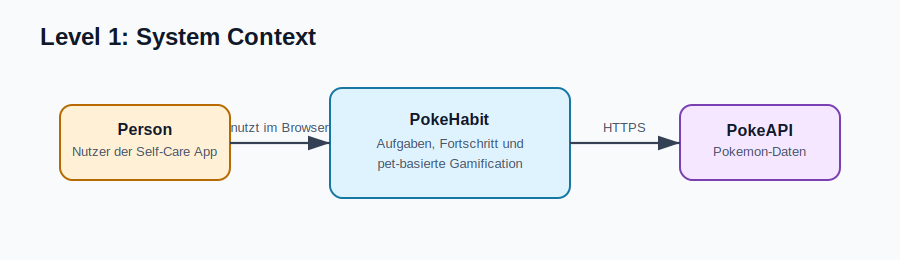
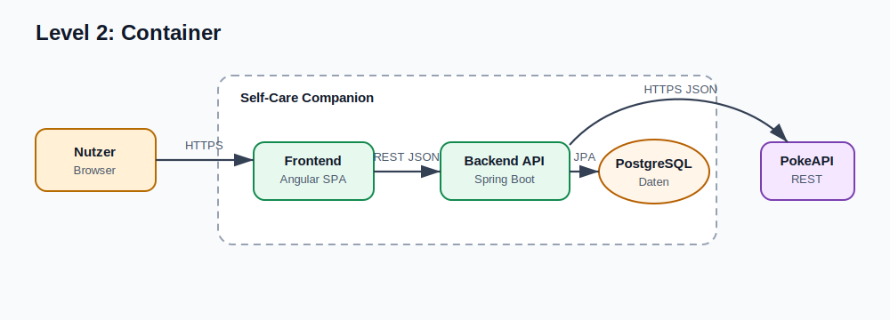
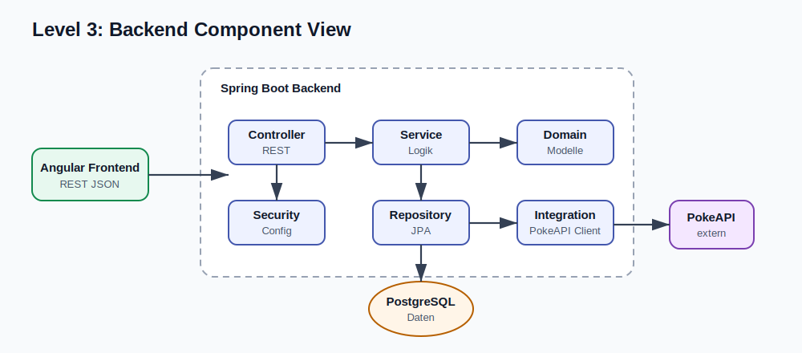

# C4 Diagramm - Self-Care Companion

Dieses Dokument beschreibt die Architektur der Self-Care Companion Webanwendung im C4-Stil. Die Diagramme bilden den aktuellen Projektstand und die geplante Zielarchitektur ab: ein Angular-Frontend, ein Spring-Boot-Backend, PostgreSQL als Datenbank und die externe PokeAPI für Pokemon-Daten.

## Visuelle Übersicht

## Diagramm-Dateien

Die Mermaid-Diagramme sind ausgelagert:

| Dateityp | Zweck |
| --- | --- |
| `.mmd` | Bearbeitbare Mermaid-Quelle |
| `.svg` | Sichtbar gerendertes Diagramm für Markdown-Preview |

Markdown kann externe `.mmd`-Dateien nicht portabel direkt rendern. Deshalb wird pro Abschnitt die passende `.svg` sichtbar eingebettet und die zugehörige `.mmd`-Quelle direkt darunter verlinkt.

## Level 1: System Context

Mermaid-Quelle: [c4-level-1-system-context.mmd](./mermaid/c4-level-1-system-context.mmd)

### Beschreibung

| Element | Typ | Verantwortung |
| --- | --- | --- |
| Nutzer | Person | Registriert sich, meldet sich an, verwaltet Aufgaben und sieht den Fortschritt des virtuellen Begleiters. |
| Self-Care Companion | Softwaresystem | Stellt UI, Authentifizierung, Aufgabenverwaltung, Fortschrittslogik und Pokemon-Gamification bereit. |
| PokeAPI | Externes System | Liefert Pokemon-Daten wie Namen, Bilder und Eigenschaften. |

## Level 2: Container

Mermaid-Quelle: [c4-level-2-container.mmd](./mermaid/c4-level-2-container.mmd)

### Container-Verantwortlichkeiten

| Container | Technologie | Verantwortung |
| --- | --- | --- |
| Frontend | Angular, TypeScript, SCSS | Zeigt Splash-, Login- und Dashboard-Seiten, verwaltet UI-Zustand und ruft Backend-Endpunkte auf. |
| Backend API | Java 21, Spring Boot 3, Spring Web, Spring Data JPA | Kapselt REST-Endpunkte, Authentifizierung, Aufgabenlogik, Fortschrittsberechnung und externe Integrationen. |
| Datenbank | PostgreSQL | Persistiert Nutzer, Aufgaben, Aufgabenstatus und pet-bezogene Fortschrittsdaten. |
| PokeAPI | Externer REST-Service | Liefert Pokemon-Daten für die Gamification. |

## Level 3: Backend Component View

Mermaid-Quelle: [c4-level-3-backend-components.mmd](./mermaid/c4-level-3-backend-components.mmd)

### Backend-Komponenten

| Komponente | Package | Verantwortung |
| --- | --- | --- |
| Controller | `com.example.app.controller` | Definiert public und protected REST-Endpunkte für Authentifizierung, Dashboard und Aufgaben. |
| Config / Security | `com.example.app.config` | Konfiguriert Spring, Security-Regeln, CORS und spätere Authentifizierungsmechanismen. |
| Service | `com.example.app.service` | Enthält die fachliche Logik, z. B. Aufgaben abschließen, Fortschritt berechnen und Pokemon-Daten anreichern. |
| Domain | `com.example.app.domain` | Modelliert zentrale Fachobjekte wie Nutzer, Aufgaben, Status und Pet/Pokemon-Fortschritt. |
| Repository | `com.example.app.repository` | Kapselt Datenzugriff über Spring Data JPA. |
| Integration | `com.example.app.integration` | Kapselt Kommunikation mit externen Diensten, insbesondere PokeAPI. |

## Frontend Component View

Mermaid-Quelle: [c4-frontend-components.mmd](./mermaid/c4-frontend-components.mmd)

### Frontend-Komponenten

| Komponente | Verantwortung |
| --- | --- |
| Routing | Definiert Navigation zwischen Splash, Auth und Dashboard. |
| Guards | Schützen Routen für angemeldete bzw. nicht angemeldete Nutzer. |
| Pages | Bilden die groben fachlichen Ansichten der Anwendung. |
| Dashboard Components | Stellen Aufgabenliste, einzelne Aufgaben, Fortschritt und Pet-Darstellung dar. |
| Shared UI | Wiederverwendbare UI-Bausteine für Buttons, Fortschrittsbalken und Statusanzeigen. |
| Core State & Services | Verwaltet App-Zustand und lokale Browser-Speicherung. |
| Models | Typisiert Datenstrukturen für Nutzer, Authentifizierung, Aufgaben und Pet-Zustand. |

## Deployment View

Mermaid-Quelle: [c4-deployment.mmd](./mermaid/c4-deployment.mmd)

### Deployment-Hinweise

| Node | Beschreibung |
| --- | --- |
| Entwicklerrechner / Docker Host | Lokale Ausführungsumgebung für Entwicklung und Demo. |
| Frontend Container | Liefert die Angular-Anwendung aus und kommuniziert mit dem Backend. |
| Backend Container | Führt die Spring-Boot-Anwendung aus. |
| PostgreSQL Container | Speichert persistente Daten im Docker-Volume `db_data`. |
| PokeAPI | Externer Internetdienst, der nicht Teil des eigenen Deployments ist. |

## Architekturentscheidungen

| Entscheidung | Quelle / Bezug |
| --- | --- |
| Backend mit Spring Boot | `docs/adr/ADR-001-use-spring-boot.md` |
| Persistenz mit PostgreSQL | `docs/adr/ADR-003-use-postgresql.md` |
| Pokemon-Daten über PokeAPI | `docs/adr/ADR-004-use-pokeapi.md` |
| Frontend aktuell mit Angular | Abgeleitet aus `frontend/package.json` und `frontend/src/app/` |

## Abgrenzung

Das Backend enthält aktuell erst die Paketstruktur für Controller, Services, Domain, Repository und Integration. Die C4-Komponentensicht beschreibt daher die vorgesehene Architektur, die bereits durch Projektstruktur, README, ADRs und Testkonzept vorbereitet ist. Die konkrete Implementierung der REST-Endpunkte, Security-Regeln, Persistenzmodelle und PokeAPI-Integration ist noch auszubauen.
